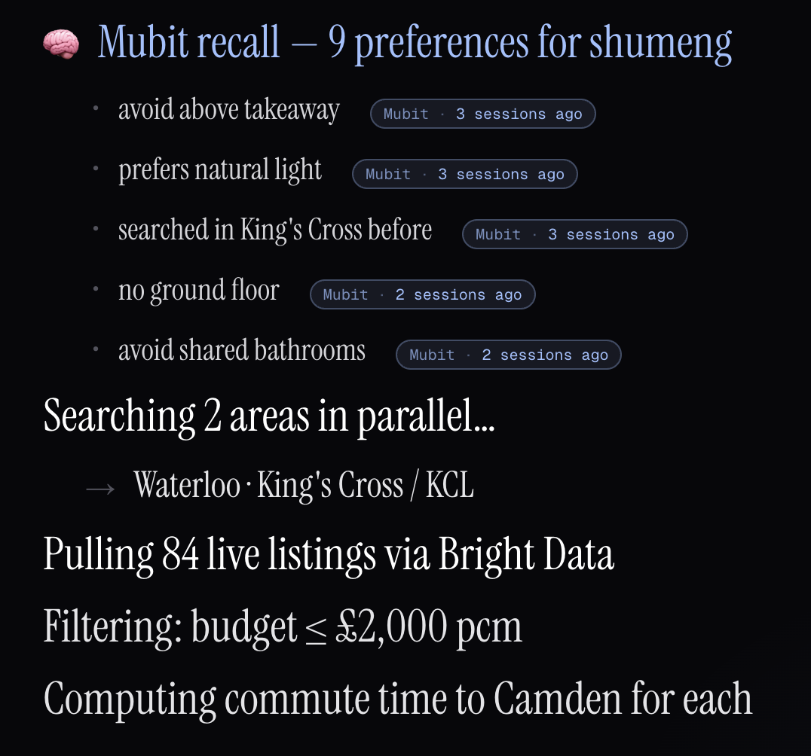
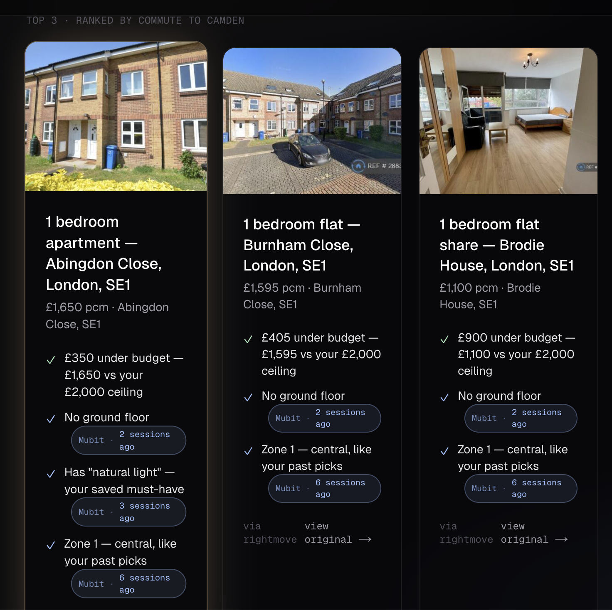

# Rentry

**An agent that finds you a flat in London the way a friend with insider knowledge would.**

Submission for [Zero to Agent](https://oscarama.notion.site/Zero-to-Agent-London-Information-Public-352f4900574780849517e736e27499b9), London — combined Vercel × Bright Data × Mubit track.

> **Live demo:** **[rentry-zero-to-agent.vercel.app](https://rentry-zero-to-agent.vercel.app)**
>
> Pick any username, describe what you want in plain English, and watch the agent reason through live listings. Log in again later as the same name and your preferences come back with you.


---

## The 30-second pitch

Renting in London is awful. Listings are stale, every site asks the same questions, and nothing remembers what you actually care about. Rentry is a conversational rental agent that:

1. Takes free-form criteria — *"Aldgate East, Waterloo, or near KCL. ~£2000 pcm. Easy commute to Camden."*
2. Pulls **live listings** from Bright Data — actual properties on the market right now, not a stale index.
3. Computes real commute times, applies budget filters, and **remembers what you said last time** — no ground floor, must have natural light, hates carpet — without you re-explaining.
4. Returns three ranked properties, each with specific green-checkmark reasons it thinks they fit. The "remembered from last session" line on the top card is the one that makes the room laugh.

The agent that helped you last year still has your back when the rent goes up. That's the whole product.

## Why all three sponsors

The product organically uses all three sponsor tools — each one does work the demo can *see*, not buzzword name-drops:

- **Vercel** — hosting, Postgres for per-username persistence, AI workflow + Server Actions running the agent loop, Fluid Compute for the streaming reasoning trace.
- **Bright Data** — live property listings fetched on demand for the user's stated criteria. Counted on screen ("84 listings") so the contribution is visible.
- **Mubit** — long-term memory of the user's preferences. Surfaces as a typographically-distinct *"remembered from last session"* line on the top result card.

Pull any one out and the demo gets weaker. That's the test.

## What makes it an agent

It's not a search box with extra steps. The flow runs as a streaming reasoning trace — searching three areas in parallel, pulling listings, computing commutes, applying remembered preferences — rendered live, one line at a time. The user watches the agent *think*.

<p align="center">
  
</p>

On the second login, the trace changes. Mubit pulls the prior session's preferences — *avoid above takeaway*, *prefers natural light*, *no ground floor* — each tagged with how long ago it was learned. Same agent, six months later, picking up where it left off. Persistence isn't a convenience feature; it's the product.

Then three property cards land with explainable fit:



Every reason on every card is grounded — the budget delta, the zone, the floor — and the violet *Mubit* badges are the ones that prove the agent remembers you.

## Architecture

```
                     ┌──────────────────────────────────────┐
   browser  ◀── SSE ─│ /api/search  (Next.js Route)         │
      │              └──────────────────┬───────────────────┘
      │                                 │
      │                       ┌─────────▼─────────┐
      │                       │   agent workflow  │
      │                       │  (workflows/)     │
      │                       └─────────┬─────────┘
      │                                 │
      │       ┌────────────────┬────────┴────────┬────────────────┐
      │       ▼                ▼                 ▼                ▼
      │  Bright Data       Mubit recall      commute calc    rank + explain
      │  live listings     prefs by user     (transit API)   (reasons w/ evidence)
      │       │                │
      │       ▼                ▼
      │  Vercel Postgres  ←────┘  per-username session state
      │
      └───────────── reasoning trace UI (typographically large, lined-out) ──
```

Built with **Next.js 16** (App Router + Turbopack), **Bun** (runtime + workspace manager), **AI SDK** on **Vercel AI Gateway**, **Vercel Postgres**, **Bright Data** for live listings, and **Mubit** for cross-session preference memory. The interface is editorial dark — Geist sans, Instrument Serif italic accents, dark zinc surfaces, subtle grain — to feel like a product, not a demo.

## Repo layout

```
apps/rentry/                  the hackathon entry
  src/app/page.tsx            auth → prompt → reasoning → results
  src/app/api/search/         streaming Route Handler
  src/workflows/search.ts     agent workflow driver
  src/lib/brightdata.ts       Bright Data integration + cache fallback
  src/lib/mubit.ts            preference recall + write-back
  src/lib/schema.ts           shared zod / TS types
apps/nextjs-explorer/         earlier experiment, kept as styling baseline
apps/productify/              abandoned earlier submission, kept for reference
```

See [`AGENTS.md`](./AGENTS.md) for monorepo conventions and [`PITCH.md`](./PITCH.md) for the full live-demo script.

## Run locally

```bash
bun install
cp apps/rentry/.env.example apps/rentry/.env.local
# then edit .env.local — BRIGHTDATA_API_KEY, MUBIT_API_KEY, POSTGRES_URL, AI_GATEWAY_API_KEY
bun run dev:rentry       # http://localhost:3002
```

## Status

Hackathon prototype, end-to-end working. Auth → prompt → live Bright Data fetch → Mubit-augmented ranking → cross-session recall is the canonical demo path and it's unbroken. Rate-limit fallbacks, pre-warmed cache, and the on-stage live-invite load handling are described in [`PITCH.md`](./PITCH.md).
